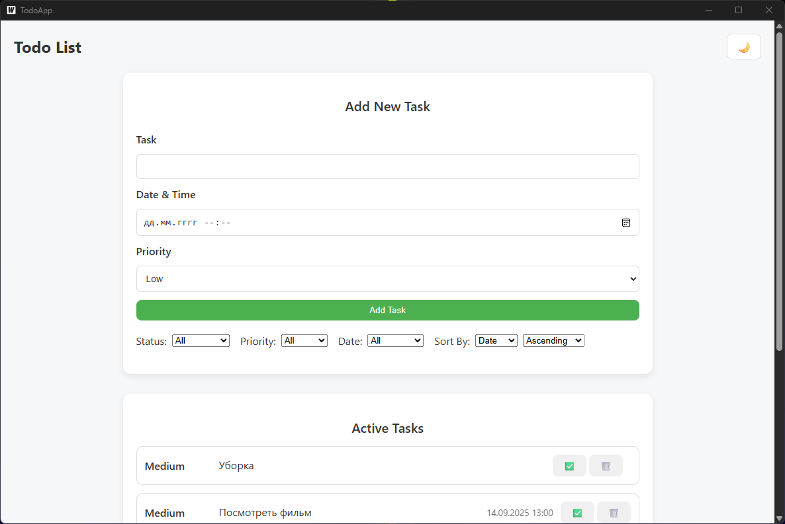
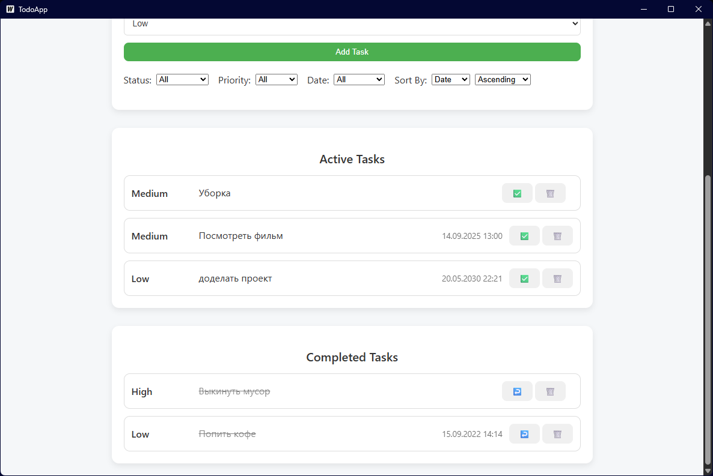
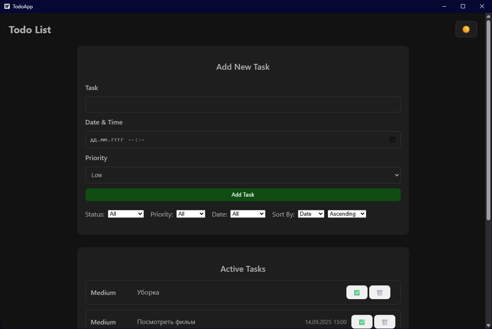
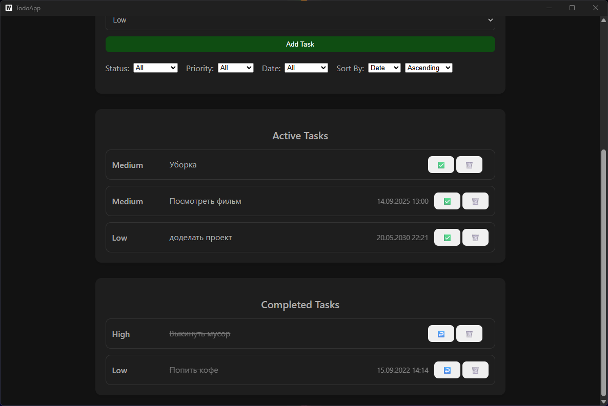
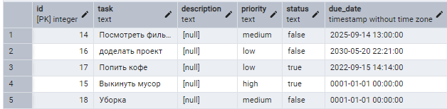

# ToDoAppTest

Приложение To-Do List на **Wails (Go + JS)**.  
Позволяет создавать, редактировать, удалять и фильтровать задачи, с сохранением состояния между перезапусками.


# Checklist для поэтапного выполнения задания

## 1. Интерфейс пользователя (25 баллов)
### ✅ Основная часть (15 баллов)
- Создать интерфейс с текстовым полем для ввода новой задачи  
- Добавить кнопку для добавления задачи в список  
- Отображать список всех задач на экране  
- Использовать CSS для стилизации интерфейса  
- Использовать значки или цвета для обозначения выполненных и невыполненных задач  

### ✅ Бонусная часть (10 баллов)
- Адаптивная верстка (корректное отображение при изменении размера окна)  
- Возможность переключения светлой/тёмной темы  

---

## 2. Добавление задач (20 баллов)
### ✅ Основная часть (10 баллов)
- Реализовать функционал добавления новой задачи в список  
- Валидация ввода (проверка на пустой ввод)  

### ✅ Бонусная часть (10 баллов)
- Возможность добавлять задачи с датой и временем выполнения  
- Установка приоритета задачи (низкий, средний, высокий)  

---

## 3. Удаление задач (15 баллов)
### ✅ Основная часть (5 баллов)
- Реализовать возможность удаления задач из списка  

### ✅ Бонусная часть (10 баллов)
- Добавить подтверждение удаления задачи (модальное окно)  

---

## 4. Управление выполнением задач (30 баллов)
### ✅ Основная часть (10 баллов)
- Реализовать возможность отметки задачи как выполненной  
- Зачеркивание текста выполненных задач  

### ✅ Бонусная часть (20 баллов)
- Перемещение выполненных задач в отдельный раздел «Выполненные задачи»  
- Возможность отмены отметки выполнения задачи (возврат в «Активные задачи»)  

---

## 5. Сохранение состояния (50 баллов)
### ✅ Основная часть (20 баллов)
- Сохранение состояния задач при закрытии приложения  
- Загрузка состояния задач при запуске приложения  

### ✅ Бонусная часть (30 баллов)
- Использование PostgreSQL для хранения задач  
- Создать и использовать **repo → service → usecase** слои для работы с данными  

---

## 6. Фильтрация и сортировка задач (20 баллов)
### ✅ Основная часть (10 баллов)
- Фильтрация задач по статусу (все / активные / выполненные)  
- Сортировка по дате добавления  

### ✅ Бонусная часть (10 баллов)
- Сортировка по приоритету  
- Фильтрация по дате (сегодня / на неделю / просроченные)  

---


## ⚙️ Технологии
- [Go](https://go.dev/) + [Wails](https://wails.io/)  
- JavaScript (Frontend)  
- PostgreSQL (хранение задач)  
- logrus (логирование)  
- godotenv (env конфигурация)  

---

 ### Скриншоты/видео







---

### Демонстрация
## 🎥 Видео-демонстрация

### Основное демо
[](https://youtu.be/o0Q7uN1tF2M)  
📂 [Скачать локальное видео](docs/video/video.mp4)

---

### Код + База данных + Демо
[](https://youtu.be/I6nU8TiZh8I)  
📂 [Скачать локальное видео](docs/video/video2.mp4)

---

## 🚀 Запуск приложения

```bash
# Клонирование репозитория
git clone https://github.com/PhoenixJustCode/TodoAppTest.git
cd TodoAppTest/test
```
#⚙️ Настройка окружения

В папке test создайте файл .env и укажите параметры подключения к базе данных:
```bash
DB_HOST=localhost
DB_PORT=5432
DB_USER=postgres
DB_PASS=postgres
DB_NAME=todoapp_db
```
## Установка зависимостей
```bash
wails doctor
wails build   # сборка
wails dev     # запуск в dev режиме
```
---